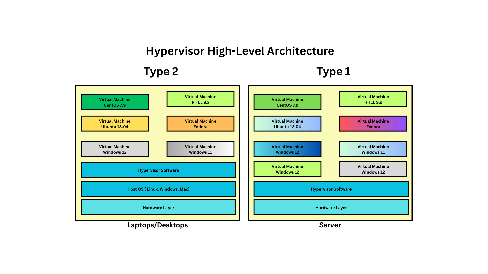

# Day 1

## Info - Hypervisor Overview
<pre>
- is nothing but virtualization technology
- two types of hypervisors
  1. Type 1 a.k.a Bare Metal Hypervisor
     - is used in Workstations/Servers
     - can expect near-native performance
     - 3% overhead
     - the OS the runs inside a Virtual Machine is called Guest OS
     - Guest OS can be Windows, Linux or Mac OS
     - there is no Host OS Layer, in case of Type 1 Hypervisor
     - the Guest OS is a fully functional Operating System with its own dedicated OS Kernel
     - each Guest OS, gets its own dedicated hardware resources
       - CPU Cores ( virtual/logical CPU cores )
       - RAM ( Actual )
       - Storage ( Actual )
     - is called heavy-weight virtualization as every VM requires dedicated H/W resources
     - examples
       - Microsoft Hyper-V ( comes with Server grade Windows OS )
       - Linux KVM ( Opensource & Free )
       - VMWare vSphere(vcenter) - Commercial license required
  
  2. Type 2 a.k.a Hosted Hypervisor
     - is used in Desktops/Workstations/Laptops
     - the OS that runs inside a Virtual Machine is called Guest OS 
     - Guest OS can be Windows, Linux or Mac OS
       - each Guest OS, gets its own dedicated hardware resources
       - CPU Cores ( virtual/logical CPU cores )
       - RAM ( Actual )
       - Storage ( Actual )
     - is called heavy-weight virtualization as every VM requires dedicated H/W resources
     - examples
       - VMWare Fusion ( Mac OS-X )
       - VMWare Workstation - Free ( Linux & Windows )
       - Parallels ( Mac OS )
       - Oracle VirtualBox - Free ( Windows, Linux & Mac )
</pre>

## Info - Hypervisor High-Level Architecture


## Info - Containerization Overview
<pre>
- it is a light-weight application virtualization technology
- each container represents one application ( or application process in OS )
- container's don't represent an Operating System
- containers will never be able to replace OS or VMs
- generally one process runs per container
- container = application + dependent library + tools
- is a linux technology
- linux kernel supports
  1. Namespace 
     - one container can be isolated from other containers
  2. Control Groups or CGroups
     - we can apply resource quota restrictions on container level
     - we can restrict how much RAM a particular can utilize at the max
     - we can restrict how much storage a particular can utilize at the max
     - we can restrict how much % of CPU can be utilized by a single container
- Container Engine
  - is a high-level user-friendly software that manages containers and images
  - under the hood, container engines depends on Container Runtimes to manage containers and images
  - examples
    - Docker
      - is a container engine
      - Docker Inc is the organization which developed runC, containerd, dockerd & docker
      - dockerd depends on containerd to manage images and containers
      - containerd in turn depends on runC container runtime to manage images and containers
    - Podman
- Container Runtime
  - is a low-level software that manages containers and images
  - it is not user-friendly, hence end-users generally don't use this directly
  - examples
    - runC
    - cRun
    - CRI-O
</pre>

## Info - Docker Overview
<pre>
- is developed in Golang by a company called Docker Inc
- Docker follows Client/Server Architecture
- Docker Application Container Engine ( Server )
  - dockerd
- Docker Client
  - docker
- The docker client/server they communicate with each other if installed on the same machine
  using local unix socket
- In case docker client runs on separate machine and server runs on another machine, they communicate using REST API
- in order to manage docker images or docker containers, we as end-users will be issuing command using the docker client
- in order to issue docker commands, one must be part of an user group called docker
- those users who are part of docker user group, they only gain read/write access to the unix socket that is usef by docker client & server
</pre>

## Info - Docker High Level Architecture


## Info - Docker Image
<pre>
- is a blueprint of a container
- Image => An application + with all its dependencies
- it is a JSON file which refers to multiple docker image layers
- in other words, image is further broken down into many image layers
- just like every image has an unique name and id, image layers also has their own unique ID
- the unique ids are 256 bit HASH
- the image layers can be shared by multiple docker images
</pre>

## Info - Docker Image Layers


## Info - Docker Container
<pre>
- is a running instance of a Docker Image
- each container gets its own file system ( files and folders )
- each container gets its own unique name and IP address
- each container gets its own Network stack ( OSI - 7 layers )
- each container uses its own namespaces ( 7 types of namespaces )
  - PID namespace
  - network namespace
- every containter gets is own Port range ( 0 - 65535 )
- it is for these reasons, people tend to compare a container with a VM or an Operating System
- technically comparing an OS with container is wrong, but because they have OS/VM and container has some common
  features, people tend make this sort of comparisons
- container will have its own hostname just like VMs/OS
</pre>

## Lab - Find your docker version
```
docker --version
```

## Lab - Listing the docker images present in your local docker registry
```
docker images
```


## Lab - Create a container in interactive mode
```
docker run -it --name ubuntu1-jegan --hostname ubuntu1-jegan ubuntu:latest /bin/bash
hostname
hostname -i
ls -l
exit
```

Note
<pre>
docker - is the client tool
run - will create a new container and start it
ubuntu1-jegan - is the name of the container and it must be unique  (optional but as a best practice always provide one)
ubuntu1-jegan - is the hostname of the container (optional but as a best practice always provide one)
ubuntu:latest - is the docker image name from your local docker registry
/bin/bash - is the terminal that will be started inside the container
when you exit from a container that is interactively created, it end up stopping the container
</pre>

## Lab - Creating a container without custom name or hostname
```
# Create new container and start it in interactive mode
docker run -it ubuntu:latest /bin/bash

# Find its hostname assigned by docker server
hostname

# Finds its ip address
hostname -i

# Come out of the container shell, this will also end up terminating the container
exit
```

List only running containers
```
docker ps 
```

List all containers
```
docker ps -a
```

Starting a exited container
```
docker start unruffled_leakey
docker ps

docker exec -it unruffled_leaky /bin/bash
hostname
hostname -i
ls
exit
docker ps
```


## Lab - Deleting a running container

Ideally to delete a container, we must stop it first
```
# List all running containers
docker ps

# Stop one container
docker stop ubuntu1-jegan

# Delete container
docker rm ubuntu1-jegan

# List all running containers
docker ps 
```


## Lab - Downloading image from Docker Hub Remote Registry to Local Docker Registry
```
docker pull mysql:latest
docker images
```


## Lab - Find more details about a docker image
```
docker inspect image mysql:latest
```


## Lab - Creating a container in interactive(foreground) mode and coming out of container shell without stopping it
```
docker run -it --name ubuntu1-jegan --hostname ubuntu1-jegan ubuntu:latest /bin/bash
hostname
hostname -i
```

Let's say, you wish to come out of the ubuntu1-jegan container shell without stopping it
```
Press Ctrl+P followed by Ctrl+Q
```

Now check if the container is still running
```
docker ps
```


## Lab - Creating a custom docker image
Create a sub-folder under your home directory

Create a file named Dockerfile, place this file in a sub-folder
<pre>
FROM ubuntu:latest

RUN apt update && apt install -y vim tree default-jdk iputils-ping net-tools
</pre>

Build your custom docker image
```
mkdir ~/CustomDockerImage
cd ~/CustomDockerImage
touch Dockerfile
docker build -t jegan/ubuntu:1.0 .
docker images | grep jegan
```

Create a container using your custom docker image
```
docker run -dit --name c1-jegan --hostname c1-jegan jegan/ubuntu:1.0 /bin/bash
docker ps
docker exec -it c1-jegan /bin/bash
ifconfig
tree
vim
javac -version
java -version
exit
```


## Lab - Deleting a docker image from local docker registry
```
docker pull hello-world:latest
docker images hello-world:latest
docker rmi hello-world:latest
docker images hello-world:latest
```


## Lab - Find more details about a container
```
docker ps
docker inspect c1-jegan
docker inspect -f {{.NetworkSettings.Networks.bridge.IPAddress}} c1-jegan
docker inspect c1-jegan | grep IPA
```


## Lab - Setting up a load-balancer manually using docker containers
Let's create 3 webserver containers
```
docker run -d --name webserver1-jegan --hostname webserver1-jegan nginx:latest
docker run -d --name webserver2-jegan --hostname webserver2-jegan nginx:latest
docker run -d --name webserver3-jegan --hostname webserver3-jegan nginx:latest
```
Lets's create a loadbalancer container with port forward to expose this container for external access
```
docker run -d --name lb-jegan --hostname lb-jegan -p 8080:80 nginx:latest
```


List and check all your containers
```
docker ps | grep jegan
```

Copy the nginx.conf from lb container to your local machine
```
docker cp lb-jegan:/etc/nginx/nginx.conf .
cat nginx.conf
```

Find the IP addresses of your web server containers
```
docker inspect webserver1-jegan | grep IPA
docker inspect webserver2-jegan | grep IPA
docker inspect webserver3-jegan | grep IPA
```

Update the nginx.conf file as shown below with your webserver1-jegan, webserver2-jegan and webserver3-jegan
<pre>

user  nginx;
worker_processes  auto;

error_log  /var/log/nginx/error.log notice;
pid        /run/nginx.pid;


events {
    worker_connections  1024;
}

http {
    upstream myapp1 {
        server 172.17.0.5:80;
        server 172.17.0.6:80;
        server 172.17.0.7:80;
    }

    server {
        listen 80;

        location / {
            proxy_pass http://myapp1;
        }
    }
}
</pre>

Copy the configured nginx.conf file back into the lb container
```
docker cp nginx.conf lb-jegan:/etc/nginx/nginx.conf
```

To apply config changes done to load balancer container, restart that container
```
docker restart lb-jegan
docker ps
```

To customize the html responses from each webserver
```
echo "<h1>Web server 1</h1>" > index.html
docker cp index.html webserver1-jegan:/usr/share/nginx/html/index.html

echo "<h1>Web server 2</h1>" > index.html
docker cp index.html webserver2-jegan:/usr/share/nginx/html/index.html

echo "<h1>Web server 3</h1>" > index.html
docker cp index.html webserver3-jegan:/usr/share/nginx/html/index.html
```

Check if the respective webserver are responding with the customized output
```
curl http://172.17.0.5:80
curl http://172.17.0.6:80
curl http://172.17.0.7:80
```

Finally check the load balancer response from your lab machine web browser
```
localhost:8080
```


