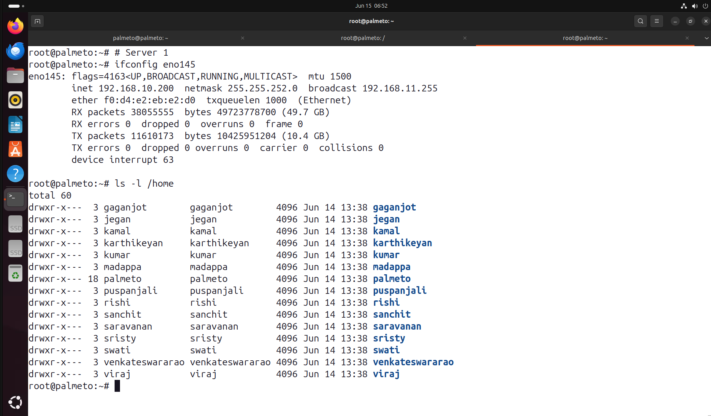
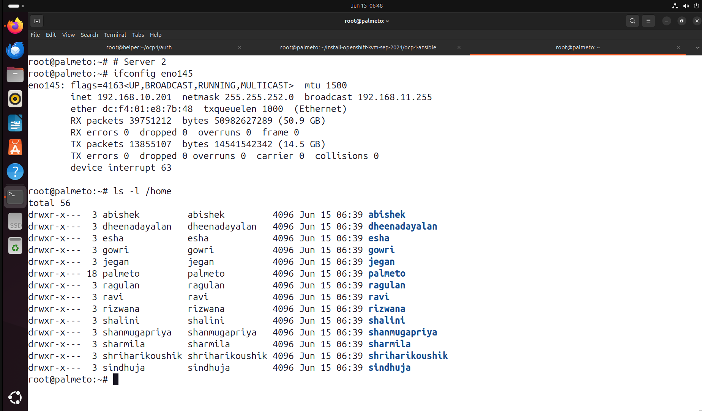

# Red Hat Openshift 15-19 June 2026

# Pre-test url
https://forms.office.com/r/TCHVgW0Yic

## Server 1 ( 192.168.10.200 )
<pre>
Dell PowerEdge R840 Server
Processor - Intel Xeon Processor with 192 CPU Cores
RAM - 1 TB
SSD - 21.1 TB Storage 
Ubuntu 24.04 64-bit OS
</pre>
Participants

## Server 2 ( 192.168.10.201 )
<pre>
Dell PowerEdge R840 Server
Processor - Intel Xeon Processor with 192 CPU Cores
RAM - 1 TB
SSD - 21.1 TB Storage 
Ubuntu 24.04 64-bit OS
</pre>

Participants

Check you lab

